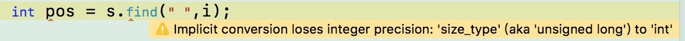

# Leetcode-Contest-60
    
[题目传送门](https://leetcode.com/contest/weekly-contest-60/)

非常不错的一次contest! 除了第二题我觉得题意有点含糊没有说清让人容易误解外，整套题目的质量很高。

## A. Flood Fill

水BFS

## B. Sentence Similarity

题意是给你两个由单词组成的句子(字符串)，其中单词两两之间存在着相似的关系，判断这两个句子是不是相似的。
    
注意，这个句子的相似是单词两两对应的关系！因此长度首先得相等，其次两个句子的第i个单词都是相似的。
    
理解了这一点，就可以随便用一些STL库实现了。我用的multimap，然后各种vector或者map套set等等都可以。

~~读题一时爽，写时火葬场。我做的时候以为单词不需要两两对应而是任意匹配，用multimap写了半天才发现问题，太ZZ了。~~

```
map<pair<string,string>, bool> mp;
bool areSentencesSimilar(vector<string>& words1, vector<string>& words2, vector<pair<string, string>> pairs) {
        if (words1.size() != words2.size())
            return false;
        rep (i,0,(int)pairs.size()-1){
            mp[pairs[i]] = true;
        }
        rep (i,0,(int)words1.size()-1){
            if (words1[i]!=words2[i]&&!mp[make_pair(words1[i],words2[i])]&&!mp[make_pair(words1[i],words2[i])])
                return false;
        }
        return true;
}
```

## C.Asteroid Collision

题意就是有一个代表球的质量的序列，正数代表向右走，负数代表向左走，然后两球相撞质量大的留下，相等就全部走，问最后的序列。

反正是模拟，然后需要注意的是：

**不要用vector同时迭代器增加与删除，因为一旦删除导致迭代器失效很麻烦！！！
这个时候能用pop_back()就用pop_back()，因为它的行为一定是在你的控制范围内的！！！**

代码如下：

```
class Solution {
public:
    #define rep(i,a,b) for (int i = (a); i <= (b); ++i)
    vector<int> asteroidCollision(vector<int>& a) {
        int n = a.size();
        vector<int> ans;
        rep (i,0,n-1){
            if (a[i] >= 0){
                ans.push_back(a[i]);
                continue;
            }
            bool zy = true;
            while (!ans.empty() && ans.back() > 0){
                if (ans.back()<-a[i])
                    ans.pop_back();
                else if (ans.back() == -a[i]){
                    ans.pop_back();
                    zy = false;
                    break;
                }else{
                    zy = false;
                    break;
                }
            }
            if (zy)
                ans.push_back(a[i]);
        }
        return ans;
    }
};
```


## D.Parse Lisp Expression

Lisp解释器，设计的指令是let、add和mult。三种指令的形式：

>
 * (let v1 e1 v2 e2 ... vn en expr) 赋值语句v1 = e1, v2 = e2, 返回的结果是表达式expr
 * (add e1 e2) 返回e1+e2，没有赋值
 * (mult e1 e2) 同上，乘法

难点在于let指令赋值的变量需要考虑变量所在层次，即例如：

```
(let x 2 y (add 0 (let x 500 0)) (add 0 (add 0 (add x 3))))
第一层给x赋值为2，y赋值的分支（在第二层）虽然给x赋值了100，但是最终求的那个表达式用到的x还是最接近它的外层，即x=2，最终的结果是5.
```

这类非常经典的类似编译原理的题，我们不可以写的过急，最好心里有一个大致的设计，尽量避免大量重用代码。我写了300多行好不容易才过了这个题，然后读到了一些dalao的代码，找了2个分析如下：

```
class Solution3 {
private:
    unordered_map<string, int> hash; //内部实现了哈希表的Map，查找速度比map块，O(1)vsO(logn)
    
    string getNext(string& e, int& idx) { //前面一个引用是为了因为我们无需修改e，减少拷贝赋值的是空开销；后面一个引用相当于一个变参，我们之后继续用这个改变后的变参
        string ret = "";
        int cnt = 0;
        while (e[idx] != ' ' || cnt != 0) { //遇到一个完整的括号就匹配结束，或者遇到下一个不在括号里的空格
            ret += e[idx];
            if (e[idx] == '(') cnt ++;
            if (e[idx] == ')') cnt --;
            idx ++;
        }
        idx ++;
        return ret; //把这一部分的字符串值返回
    }
    
    int calculate(string e) {
        if (e[0] != '(') {  //代表没有子结构，是一个整数或者
            if (hash.count(e) > 0) return hash[e];  //已经存过的标识符就直接去map里找
            return stoi(e); //字符串转数字的值
        }
        e.back() = ' ';
        if (e[1] == 'l') {
            auto bak = hash;
            int p = 5;
            while (true) {
                string a = getNext(e, p);
                if (p >= e.size()) {
                    int ret = calculate(a);
                    hash = bak; //！！！每一层次做完这个层次自己定义的变量就可以舍弃了
                    return ret;
                }
                string b = getNext(e, p);
                hash[a] = calculate(b);
            }
        } else {
            int p = (e[1] == 'a' ? 5 : 6);
            string a = getNext(e, p), b = getNext(e, p);
            if (e[1] == 'a') {
                return calculate(a) + calculate(b);
            } else {
                return calculate(a) * calculate(b);
            }
        }
    }
    
public:
    int evaluate(string expression) {
        hash.clear();
        return calculate(expression);
    }
};
```

还有一个比较暴力的，先拆成各个部分，再各个部分递归做，和上面的相比，可能时间复杂度稍微高了点，不过思路非常清晰。

```
class Solution4 {
    int eval(string s, map<string, int> p) {
        int n = s.length(), i, j, k, a, d, a1, a2, ans;
        vector<string> ss;
        
        if (s == "") return 0;
        if ((s[0] >= '0') && (s[0] <= '9')) return stoi(s);
        if (s[0] == '-') return stoi(s);
        if (s[0] == '+') return stoi(s);
        if ((s[0] >= 'a') && (s[0] <= 'z')) return p[s];
        
        // solve sub problems
        s[s.length() - 1] = ' ';
        for (i = 1; i < s.length(); i++) { //先把字符串拆分成各个部分
            if (s[i] == '(') {
                d = 0;
                for (j = i; j < s.length(); j++) {
                    if (s[j] == '(') d++;
                    if (s[j] == ')') {
                        d--;
                        if (d == 0) {
                            ss.push_back(s.substr(i, j - i + 1));
                            i = j;
                            break;
                        }
                    }
                }
            }
            else if (s[i] != ' ') {
                for (j = i + 1; (j < s.length()) && s[j] != ' '; j++);
                ss.push_back(s.substr(i, j - i));
                i = j;
            }
        }
        
        if (ss[0] == "let") {
            for (i = 1; i < ss.size() - 1; i += 2) {
                d = eval(ss[i + 1], p);
                p[ss[i]] = d;
            }
            ans = eval(ss[ss.size() - 1], p);
        }
        
        if (ss[0] == "add") {
            a1 = eval(ss[1], p);
            a2 = eval(ss[2], p);
            ans = a1 + a2;
        }
        
        if (ss[0] == "mult") {
            a1 = eval(ss[1], p);
            a2 = eval(ss[2], p);
            ans = a1 * a2;
        }
        
        return ans;
    }
public:
    int evaluate(string s) {
        map<string, int> p;
        return eval(s, p);
    }
};
```


最后指出一个在写这个代码发现的一个一直以来存在隐患的坏习惯，就是对于string或者vector类似的东西，当我需要一个变量的时候，我常常会用int来代替size_type


比如，

```
string s;
pos = s.find(" ",5); //从字符串s第五位开始的地方寻找空格，返回下标。如果找不到就是该字符串npos(一个大数，不同的机器可能值不同)
if (s.find(" ",i) == string::npos){
    cout << “pos=” << pos << "  s.find(...) " << s.find(" ",i) << endl;
}
```

如果这个j用的是int定义的，那么输出的结果可能是“pos=-1  s.find(...)=18446744073709551615” 问题就是这个pos的定义变量的类型出的，将一个64位整数转32位的int转换失败就成了-1（我觉得相当于符号位就是1？）其实这种写法在一般的编译器就会报warning了，例如xcode显示如下：



因此，我们应当用的类型是一个标准的类型，可以的写法如下：

* string::size_type pos
* size_t pos
* unsigned long long pos

其中附上一段size_type的介绍：

> size_type由string类类型和vector类类型定义的类型，用以保存任意string对象或vector对象的长度，标准库类型将size_type定义为unsigned类型。

这样就不会出现find出来的结果是-1了。因此说该用标准类型就用标准类型，别都用int省事，不清楚什么类型就用auto就好了，c++11的这个功能很方便。

